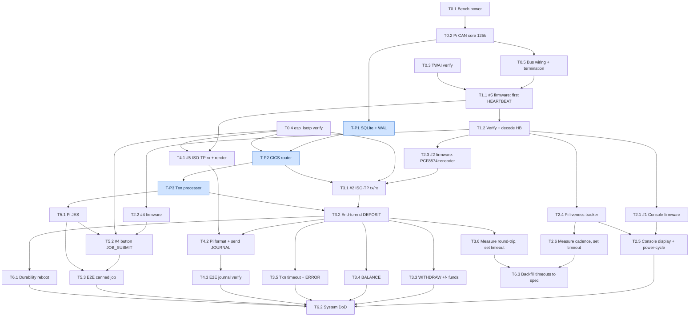

# Phase 1 Roadmap — Mainframe Simulation

> Derived from `requirements.md` (DoD) and `bring-up-checklist.md`. Milestones as
> headers; tasks within each are in **dependency order** (top to bottom = do in
> this sequence). Each task lists what it depends on, its acceptance criteria
> (cross-referenced to the DoD), a rough estimate, and notes/risks.
>
> Last updated: 2026-07-01.

---

## Task dependency graph

Arrows point from prerequisite → dependent. Blue = Pi software track (parallel).
The two critical paths are M0 → M1 → M2 (liveness) and M0 → Pi track → M3
(transaction core).

> If the diagram does not render in your viewer, it is Mermaid — GitHub, VS Code
> (with a Mermaid extension), and most markdown previewers display it; otherwise
> the text above is still readable as an indented dependency list.

---

## How to read the estimates

Estimates are **focused-work hours**, deliberately rough. They are inflated by
this project's own rules — verify-don't-assume, understanding over speed — so
they are larger than a "just make it run" estimate would be. Integration tasks
(marked ⚠ **high variance**) can easily double; they depend on how the hardware
behaves, which is unknown until powered. Treat milestone totals as ranges, not
commitments.

**Critical path:** M0 → M1 → M2 (liveness needs #1) and M0 → *Pi software track*
→ M3 (transaction core). The **Pi software track** (T-P1…T-P3 below) has no MCU
dependency and can be built in parallel with M1/M2 firmware.

---

## Parallel track — Pi software (start any time after M0)

These are off the MCU critical path. Doing them during M1/M2 means M3 is not
gated on writing them from scratch.

**T-P1 — SQLite schema + WAL + write-ahead pattern**
- Depends on: M0 (Pi reachable)
- Acceptance: `accounts` and `transactions` tables created per system-design §5;
  `PRAGMA journal_mode` returns `wal` (req §3.1); a scripted insert exercises
  PENDING → balance update → COMMITTED as one atomic transaction; balance stored
  as integer cents.
- Estimate: 2–3h
- Notes: sole-writer model; no concurrency handling needed in Phase 1.

**T-P2 — CICS router skeleton (ISO-TP receive + route)**
- Depends on: T-P1, M0 (`esp_isotp`/`python-can-isotp` verified)
- Acceptance: process receives a reassembled ISO-TP payload on the transaction
  channel `(0x250, 0x240)`, decodes the `type` nibble, and routes to a stub
  handler (req §4.2). Verifiable with a Pi-side loopback or a canned frame.
- Estimate: 3–4h
- Notes: local IPC to the processor is a socket/queue — keep it simple.

**T-P3 — Transaction processor (deposit/withdraw/balance logic)**
- Depends on: T-P1, T-P2
- Acceptance: applies DEPOSIT/WITHDRAW/BALANCE against SQLite; withdraw past
  balance returns INSUFFICIENT_FUNDS as a *result*, not an error (req §4.2.3);
  balance query does no write (req §4.2.4).
- Estimate: 3–4h

*Parallel-track subtotal: ~8–11h (overlaps M1/M2).*

---

## M0 — Bench, toolchain & Pi CAN core

**Goal:** the Pi can see CAN frames, the toolchain is verified, the bus is wired
and terminated. Nothing MCU-side is testable until this passes.

**T0.1 — Bench power & safety wiring**
- Depends on: —
- Acceptance: checklist §6 all PASS — MCUs on 5V bench supply, Pi on its own
  5V/3A supply, no 5V on any C3 GPIO, logic analyzer GND on common bus GND.
- Estimate: 0.5–1h

**T0.2 — Pi HAT install + SocketCAN up at 125 kbit/s**
- Depends on: T0.1
- Acceptance: checklist §3.2–3.6 — overlay `oscillator=12000000` set; `dmesg`
  shows MCP2515 init OK; `ip link` shows `can0`; `sudo ip link set can0 up type
  can bitrate 125000` succeeds; `candump can0` idle-clean (req §3.1).
- Estimate: 1–2h
- Notes: SPI must be enabled; overlay in `/boot/firmware/config.txt` on current
  Raspberry Pi OS. 125k is the bring-up speed (checklist 2.5).

**T0.3 — TWAI verification (raw CAN)**
- Depends on: — (can run before hardware wiring)
- Acceptance: checklist §5.1, 5.3, 5.4 — min IDF version recorded, `esp32c3` in
  supported targets, TWAI API style noted (v5.x node-based vs legacy). Verify
  symbols via `mcp-api-doc` before any firmware.
- Estimate: 0.5–1h
- Notes: **use `mcp-api-doc` skill** — do not code TWAI from memory.

**T0.4 — esp_isotp verification (multi-frame transport)**
- Depends on: —
- Acceptance: checklist §5.2, 5.5 — `espressif/esp_isotp` available for the IDF
  version, `esp32c3` supported, error/abort surface documented (needed for the
  TIMEOUT ERROR frame, req §4.2.5).
- Estimate: 0.5–1h
- Notes: only gates M3+ (transaction/journal/job). Not needed for heartbeat.

**T0.5 — Bus wiring + termination**
- Depends on: T0.2
- Acceptance: checklist §1 — CANH/CANL twisted, common GND across all nodes +
  Pi, HAT 120R jumper IN (Pi = bus end), one external 120Ω at the far-end MCU,
  no other terminators added (middle-node VP230 fixed 120Rs stay — checklist 2.5).
- Estimate: 1–2h
- Notes: with the fixed middle 120Rs, expect lower-than-ideal bus impedance;
  125k gives margin. Measure CANH–CANL ≈ some value < 60Ω unpowered and record.

*M0 subtotal: ~3.5–7h*

---

## M1 — First light (one MCU heartbeats, Pi sees it)

**Goal:** prove the entire CAN pipeline end-to-end with the simplest node. This
is the highest-risk milestone — most unknowns resolve here.

**T1.1 — #5 Output Writer firmware: TWAI init + OLED splash + HEARTBEAT** ⚠
- Depends on: M0, T0.3
- Acceptance: req §3.5 — boots without panic, OLED shows boot splash, emits a
  HEARTBEAT frame (`ID=0x000`, 6 bytes, `source=5`) visible on `candump`.
- Estimate: 3–5h ⚠ **high variance** — first firmware; TWAI timing config,
  transceiver wiring, and bus termination all get proven here at once.
- Notes: if no frame appears, bisect: TWAI loopback mode first (no transceiver),
  then transceiver, then bus. Chosen as first node because it has no input
  peripherals — least to go wrong beyond the CAN path itself.

**T1.2 — Verify + decode first HEARTBEAT**
- Depends on: T1.1
- Acceptance: payload decodes to `type|version=0x10`, `source=5`, `uptime`
  increments across frames (req §4.1 partial); logic analyzer sigrok CAN decode
  agrees with `candump`.
- Estimate: 0.5–1h

*M1 subtotal: ~3.5–6h*

---

## M2 — Liveness complete (all nodes + Console display)

**Goal:** all four MCUs heartbeat; Console #1 shows per-node live/dead.

**T2.1 — #1 Operator Console firmware: TWAI + OLED + buttons/LEDs + heartbeat**
- Depends on: M1 (pipeline proven)
- Acceptance: req §3.2 — boots, OLED splash, button press + LED confirmed on
  serial, emits HEARTBEAT (`source=1`).
- Estimate: 2–3h
- Notes: much faster than T1.1 — CAN path is now known-good.

**T2.2 — #4 Job Submitter firmware: TWAI + OLED + button + heartbeat**
- Depends on: M1
- Acceptance: req §3.4 — boots, OLED splash, button on serial, HEARTBEAT
  (`source=4`).
- Estimate: 2–3h

**T2.3 — #2 Transaction Terminal firmware: TWAI + OLED + PCF8574 keypad + encoder + heartbeat** ⚠
- Depends on: M1
- Acceptance: req §3.3 — boots, OLED splash, PCF8574 acknowledged on I²C scan,
  keypad key registers, encoder rotation registers, HEARTBEAT (`source=2`).
- Estimate: 4–6h ⚠ — most complex node: PCF8574 (0x20–0x27) keypad scanning +
  KY-040 encoder. Confirm no I²C address clash with OLED (checklist §4).
- Notes: done last on purpose — CAN is proven, so failures isolate to peripherals.

**T2.4 — Pi liveness tracker**
- Depends on: M1, M0
- Acceptance: registers each node alive within 2s of first heartbeat; flags a
  node dead after the liveness timeout (req §4.1).
- Estimate: 2–3h

**T2.5 — #1 Console liveness display + power-cycle test**
- Depends on: T2.1, T2.4
- Acceptance: req §4.1 — OLED shows live/dead for all four nodes; powering one
  MCU off flags it dead within timeout without affecting others; power-on
  re-flags alive within 2s.
- Estimate: 2–3h

**T2.6 — Measure heartbeat cadence + set liveness timeout**
- Depends on: T2.4
- Acceptance: checklist §7.5–7.6 — cadence measured over 30s, liveness timeout
  set to 3× cadence; logged in `learning-log.md`.
- Estimate: 1h

*M2 subtotal: ~13–19h*

---

## M3 — Transaction core (the heart of Phase 1)

**Goal:** #2 submits a real deposit/withdraw/balance that reaches SQLite and
returns a result to the OLED. Uses the Pi software track (T-P1…T-P3).

**T3.1 — #2 ISO-TP tx/rx: build TXN_REQUEST, receive TXN_RESULT** ⚠
- Depends on: T2.3, T0.4, T-P2
- Acceptance: pressing confirm sends `TXN_REQUEST` (`type=0x30`) on `(0x250,
  0x240)` visible on `candump` with correct `tag`, `txn_type`, account, amount;
  receives `TXN_RESULT` (`type=0x40`) and displays it (req §4.2.1 partial).
- Estimate: 3–4h ⚠ — first ISO-TP integration on the MCU side.

**T3.2 — End-to-end DEPOSIT** ⚠
- Depends on: T3.1, T-P3
- Acceptance: full req §4.2.1 — request routed, PENDING→balance→COMMITTED written
  atomically, TXN_RESULT SUCCESS with new balance, OLED shows result, COMMITTED
  row present with correct fields.
- Estimate: 2–4h ⚠ **high variance** — first full round-trip through both sides.

**T3.3 — WITHDRAW (success + insufficient funds)**
- Depends on: T3.2
- Acceptance: req §4.2.2 (balance decreases) and §4.2.3 (INSUFFICIENT_FUNDS
  result, no balance change, no COMMITTED row, OLED shows rejection).
- Estimate: 1–2h

**T3.4 — BALANCE query**
- Depends on: T3.2
- Acceptance: req §4.2.4 — returns correct balance, no DB write, OLED shows it.
- Estimate: 1h

**T3.5 — Transaction timeout + ERROR frame**
- Depends on: T3.2
- Acceptance: req §4.2.5 — #2 exits WAITING after txn timeout, shows timeout
  error, emits a `TIMEOUT` ERROR frame (`class=1`, `subcode=0x1`) on `candump`.
- Estimate: 2–3h
- Notes: exercises the raw-frame ERROR path (protocol-spec §7.4) — the case where
  transport itself is the fault, so it must not be ISO-TP.

**T3.6 — Measure txn round-trip + set txn timeout**
- Depends on: T3.2
- Acceptance: checklist §7.1–7.4 — SQLite commit latency + CAN round-trip
  measured; txn timeout set to ≥3× worst case; logged.
- Estimate: 1h

*M3 subtotal: ~10–15h (excludes parallel track already counted)*

---

## M4 — Journal path (Output Writer #5)

**Goal:** every transaction result renders on #5's OLED, including failure reason.

**T4.1 — #5 ISO-TP rx + render JOURNAL to OLED rows**
- Depends on: M1 (#5 firmware exists), T0.4
- Acceptance: receives `JOURNAL` (`type=0x80`) on `(0x4A0, 0x4B0)`, decodes 1
  discriminator + 4×21-byte ASCII lines, writes line N to OLED row N (req §4.3).
- Estimate: 2–3h

**T4.2 — Pi: format + send JOURNAL after every result (incl. failure reason)**
- Depends on: T3.2, T4.1
- Acceptance: Pi sends a JOURNAL frame for SUCCESS *and* FAILED results; FAILED
  includes the reason string sourced from the `reason` byte (req §4.3, OQ-1
  decision). Pi maps `reason` enum → human-readable line.
- Estimate: 2h

**T4.3 — End-to-end journal verify**
- Depends on: T4.1, T4.2
- Acceptance: after a deposit and after an insufficient-funds withdraw, #5 OLED
  reflects each, reason visible on the failure (req §4.3).
- Estimate: 1h

*M4 subtotal: ~5–6h*

---

## M5 — Job path (Job Submitter #4)

**Goal:** button on #4 submits one hardcoded job through JES to completion.

**T5.1 — Pi JES process**
- Depends on: T-P3
- Acceptance: receives `JOB_SUBMIT` (`type=0x50`) on `(0x390, 0x380)`, assigns
  `jobId`, sends `JOB_ACCEPT` (`type=0x60`), dispatches to the processor, sends
  `JOB_COMPLETE` (`type=0x70`) (req §4.4).
- Estimate: 3–4h

**T5.2 — #4 firmware: button → hardcoded JOB_SUBMIT + display**
- Depends on: T2.2, T0.4, T5.1
- Acceptance: button sends the hardcoded `JOB_SUBMIT` (fixed account/amount/type
  — Q3 decision); OLED shows "JOB ACCEPTED id=N" then completion (req §4.4).
- Estimate: 2–3h

**T5.3 — End-to-end canned job**
- Depends on: T5.1, T5.2
- Acceptance: full req §4.4 — job accepted, transaction committed to SQLite,
  completion shown on #4 OLED.
- Estimate: 1–2h

*M5 subtotal: ~6–9h*

---

## M6 — Durability & system integration

**Goal:** the full end-to-end system passes, and a completed transaction survives
a clean reboot.

**T6.1 — Durability (clean reboot)**
- Depends on: T3.2
- Acceptance: req §4.5 — commit a deposit, clean power-cycle the Pi, COMMITTED
  row + balance present after reboot, no leftover PENDING from it. (Narrow Phase 1
  boundary — no crash replay, Q1 decision.)
- Estimate: 1–2h

**T6.2 — System DoD** ⚠
- Depends on: M2, M3, M4, M5, T6.1
- Acceptance: req §5 — full deposit/withdraw/balance flows end-to-end; insufficient
  funds path; canned job; reboot durability; liveness holds *during* a transaction
  (heartbeat not starved — class 0 priority); one deliberate TIMEOUT produces a
  visible ERROR frame.
- Estimate: 3–5h ⚠ **high variance** — first time all pieces run together.

**T6.3 — Backfill measured timeouts into protocol-spec §6**
- Depends on: T2.6, T3.6
- Acceptance: protocol-spec §6 provisional values replaced with measured ones,
  provisional warnings removed.
- Estimate: 0.5h

*M6 subtotal: ~4.5–7.5h*

---

## Rough totals

| Milestone | Estimate |
|---|---|
| Parallel Pi track (T-P1…T-P3) | 8–11h (overlaps M1/M2) |
| M0 — bench/toolchain/CAN core | 3.5–7h |
| M1 — first light | 3.5–6h |
| M2 — liveness | 13–19h |
| M3 — transaction core | 10–15h |
| M4 — journal | 5–6h |
| M5 — job path | 6–9h |
| M6 — durability + system | 4.5–7.5h |
| **Total (parallel track counted once)** | **~55–80h focused work** |

The range is wide on purpose — the ⚠ integration tasks dominate the uncertainty,
and none of their unknowns resolve until hardware is powered. Re-estimate after
M1: first light will calibrate how the real hardware behaves and tighten
everything after it.

---

## Open items still tracked (from handoff / requirements §7)

- `RETIRED-message_protocol.md` retired-header warning — one-line doc task, not scheduled
  here (housekeeping).
- 500 kbit/s step-up + middle-node 120R desolder — stretch goal after the bus is
  proven stable at 125k (checklist 2.5 / 3.5).
