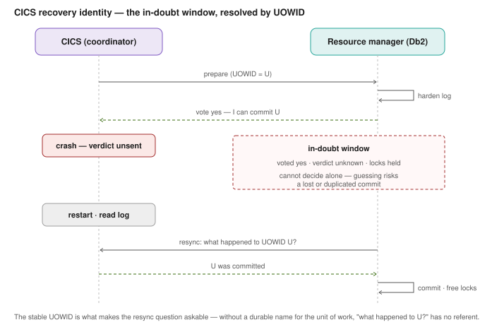
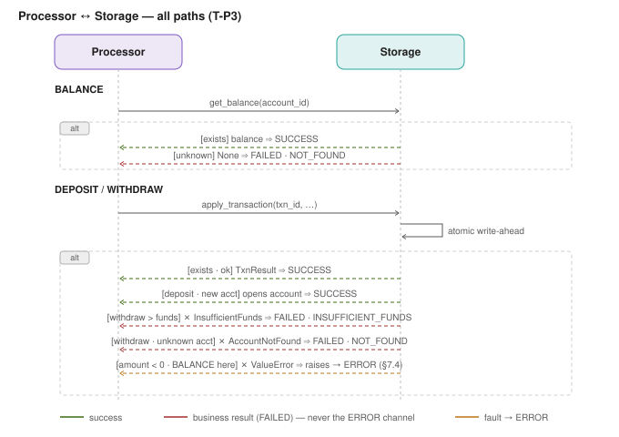
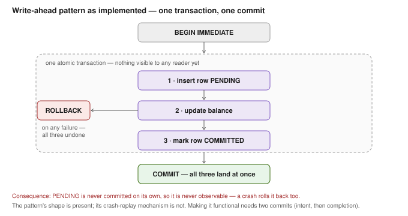

# Learning Log — Mainframe Simulation

> A dated **devlog of lessons learned** — the retrospective leg of the three-way
> learning-doc split (planning-process.md). Project-level learning *goals* live in
> `charter.md`; learning as a decision *driver* is labelled inside each ADR/spec;
> *lessons* — what was surprising, what was got wrong then right, what a failure
> taught — land here, dated, as they occur. Per-node README "lessons" sections are
> the sibling of this file at the build stage.
>
> Append-only in spirit: add entries, don't quietly rewrite past ones.
> Living document. Last updated: 2026-06-27.

---

## Entry format
Each entry: **date — short title**, then *Context* (what happened) and *Lesson*
(what to carry forward). One to three lines each; link the ADR/spec/BOM section
that records the underlying decision where one exists.

---

## Carried-over founding lessons
> Back-filled from the retired project and the existing docs — these pre-date this
> log, so they carry their original dates, not today's. They are the lessons the
> current architecture is built on.

### 2026-06-18 — A wrong-bus-for-the-role mismatch can't be patched away
**Context:** I2C was used for two roles it suits poorly — multi-master peer
messaging with runtime master/slave mode-switching, and slave mode on devices with
weak slave support. Four successive fixes (ADR-008→011) each *relocated* the same
failure instead of removing it; the project was retired (ADR-012).
**Lesson:** **Diagnose the root structural cause before redesigning.** When every
fix moves the problem rather than removing it, the architecture forcing the role is
wrong — change that, not the wire beneath it. (→ first-principles re-grounding in
ADR-0001.)

### 2026-06-18 — Hardware reality can rewrite the design
**Context:** the BOM per-node pin-budget check found the 4×4 keypad's 8 raw pins
don't fit the Transaction Terminal's free GPIO, forcing a PCF8574 I2C expander —
caught *before* purchase, not at bring-up.
**Lesson:** **Verify-before-buy.** Physical constraints feed back into the design;
checking the pin budget on paper turned a would-be bring-up failure into a line
item. (→ BOM §3; the hardware→design feedback loop in planning-process.)

---

## Lessons (current project — newest first)

### 2026-07-16 — Dedup needs an identity that is stable across retries, and the spec already had one

**Context:** designing the transaction processor (T-P3) raised "what happens if a
`TXN_RESULT` is lost and the terminal resends?" I recommended minting the transaction
UUID *inside the processor* and filed the resulting double-apply as a Phase-2
deferral. Both were wrong, and reading **locked §2** afterwards showed why: §2 already
specifies that *"the Pi mints the UUID on first receipt and stores the `tag ↔ UUID`
binding in the log"* — i.e. mint at **ingress** (the router), with the binding as the
durable link. `tag ≈ CICS task number` (compact, region-local, recycled);
`UUID ≈ UOWID` (durable, globally unique, lives in the log).

The survey of how this is really done, and why the tag alone cannot carry it:

| mechanism | identity | dedup enforced by |
|---|---|---|
| **CICS session sequence numbers** (SNA/LU6.2) | `(session, seq)` — origin counter | high-water mark; **discard** the duplicate |
| **CICS application idempotency table** | application key (often an origin UUID) | a **separate** `processed_requests` table; **replay** the stored reply |
| **CICS UOWID / NETUOWID** | durable unit-of-work id | not request-dedup at all — **recovery**: resync an in-doubt UOW after a crash (diagram below) |
| **Ours (§2, locked)** | `tag` at ingress → `UUID` in the log | the `tag ↔ UUID` binding — mint on *first* receipt, reuse on a repeat |

Two traps the survey exposed. (1) The `uint16` tag is **transient by design** — §2 sizes
its sequence field for ~256 in-flight per node, so it *recycles*; it correlates a reply
to an in-flight request and can never be the durable key. That is exactly the
task-number/UOWID split, not an oversight. (2) A per-node counter's real enemy is
**reboot, not rollover**: a `uint32` seq at 10 txn/s takes ~13.6 years to wrap, but an
MCU reset restarts it at 0 immediately and re-emits keys the Pi has already bound —
so a *fresh* transaction gets swallowed as a duplicate. The cheap fix is an NVS **boot
epoch** (one flash write per power cycle, not per transaction) making post-reboot keys
unambiguously new. Note SNA can afford to *discard* duplicates because its session
guarantees ordered delivery; we must **replay the stored result** instead, because our
retries exist precisely when the result frame was lost — discarding would leave the
terminal waiting forever.

**Lesson:** **the identity that dedups must be assigned at or before the point of
retransmission** — mint it downstream and every retry mints a new one, so the "dedup
key" cannot possibly detect a duplicate. Two corollaries. (1) *Two identities, two
jobs*: a compact recycled tag for in-flight correlation, a durable unique id for the
log — conflating them breaks one or the other, which is why CICS separates task number
from UOWID and why §2 copies that split. (2) *Recovery dedup ≠ request dedup*: the
UOWID exists so a crashed participant can ask "what happened to U?" and get a
consistent answer — a question that is unaskable without a durable name. We have one
resource manager (SQLite), so its atomic COMMIT *is* our 2PC and we get no in-doubt
window; our UOWID-analogue does the simpler request-dedup job.
**Process lesson:** I recommended processor-minting without reading §2 — the section
that already decided it. "Verify, don't assume" is not only for FreeRTOS symbols and
datasheets; **it applies to our own locked spec.** Read the section that owns the
decision before proposing one. (→ protocol-spec §2 (locked); ADR-0002; glossary
"Mainframe architecture"; `processor/__init__.py`.)

---

### 2026-07-16 — Every processor↔storage path, and the fault-vs-result line drawn in code

**Context:** building T-P3 forced enumerating *every* interaction between the processor
and storage, including the unhappy ones. Mapping them showed the §7.4
result-vs-error rule is not an abstraction — it is a concrete branch in the code, and
the paths split three ways, not two.

The three-way split: **success** returns a value; a **business "no"**
(`InsufficientFunds`, `AccountNotFound`) is raised by storage *as a signal*, caught by
the processor, and returned as a `FAILED` outcome with a reason code — it never reaches
the ERROR channel; a **fault** (`ValueError` on a negative amount, or BALANCE sent down
the write path) propagates *out of* `handle()` for the router to encode as an ERROR
frame. Two asymmetries are deliberate and only became legible once drawn. (1) A DEPOSIT
to a nonexistent account **succeeds** — it opens the account (the opening deposit) —
while a WITHDRAW to the same nonexistent account is `FAILED · NOT_FOUND`. That is the
strict-account decision, and before it the two disagreed: `get_balance()` signalled
not-found via `None`, but `apply_transaction()` auto-created the account, so a WITHDRAW
on an unknown account surfaced as INSUFFICIENT_FUNDS and left a phantom row —
`reason=0x2` was unreachable. (2) `InsufficientFunds` is raised *after* the PENDING
insert, and the ROLLBACK erases it — so a rejected withdrawal leaves no trace.

**Lesson:** **an exception type is not the same axis as an error.** Storage uses
`raise` for three different meanings — a business result to be converted, a fault to be
escalated, and a programming error — and the processor's job is to sort them. Deciding
which is which is an *application-layer* judgement (the end-to-end argument: only L7
knows what "correct" means), so it cannot be delegated to storage or to the transport.
Corollary for the integration: `handle()` deliberately raises on a malformed request,
so **whatever runs the processor loop must catch it and emit an ERROR frame** — an
uncaught fault takes the process down. Enumerating the unhappy paths *as a diagram*
also surfaced the auto-create inconsistency that reading the code alone had not.
(→ protocol-spec §7.4/§7.7; requirements §4.2; learning-log 2026-06-27;
`processor/__init__.py`, `storage/__init__.py`.)

---

### 2026-07-16 — The write-ahead pattern is currently structural, not functional

**Context:** asked a plain question — "do we commit PENDING first, then commit
COMMITTED?" — and the code answers **no**: all three steps
(insert PENDING → update balance → mark COMMITTED) run inside **one** `BEGIN IMMEDIATE`
transaction with a **single** `COMMIT` at the end.

That atomicity is exactly what makes a rejected withdrawal leave no trace. But it also
means the PENDING row is **never independently committed**, so it is never observable:
`status` can only ever be read as `COMMITTED`, and a crash mid-transaction rolls the
PENDING row back along with everything else. **There is nothing left to replay.** The
`storage` docstring scopes this honestly (Phase 1 = "a completed txn persists";
mid-write replay is Phase 2+), so this is not a bug against its stated goal — but
three *other* docs currently describe the mechanism as if it worked, and need
correcting: glossary "Write-ahead pattern" ("On reboot, PENDING-without-COMMITTED = an
interrupted write to replay/flag"), glossary "In-doubt" ("the project's
PENDING-without-COMMITTED rows are the analogue"), and glossary "Recovery manager /
backout" ("the boot-time replay of PENDING rows is the analogue"). Under the current
implementation no such row can exist.

**Lesson:** **a pattern's shape can be present while its mechanism is absent.** The
write-ahead structure is there — states, ordering, naming — but the property it exists
to deliver (a durable intent that survives a crash) requires the one thing the code
does not do: commit the intent *separately*, before the work. Making it real needs two
commits and buys crash replay at the cost of a genuinely visible intermediate state and
a recovery path that must handle it. Worth writing down now precisely because it is
obvious today and mystifying in six months — and because the docs already promise the
behaviour, the gap is invisible from the docs alone. (→ system-design §5; glossary
"Storage & durability", "Mainframe architecture"; README Phase 2+; `storage/__init__.py`.)

### 2026-07-10 — A kernel-level guarantee can be proven on `vcan`, off the hardware
**Context:** ADR-0003 (B1) needs two sockets on one interface to each receive every
frame. Ran `verify_socketcan_fanout.py` on the Pi over a virtual `vcan0` — 10 frames
sent, 10 received on *both* receivers. `vcan` is a valid stand-in because
multi-socket delivery is a SocketCAN *kernel* property, independent of the MCP2515.
The `uv run` build also confirmed `python-can` imports and opens sockets on the Pi —
clearing the thread that gated T-P2 (router).
**Lesson:** separate "is the semantic real" from "does the hardware work." The first
is a kernel guarantee, testable today on `vcan` with zero wiring; the second
(bitrate, transceiver, HAT) stays the M0 bench gate. Proving the cheap half early
de-risks the design without waiting on hardware. (→ ADR-0003; bring-up-checklist §7.)

### 2026-07-10 — A settled design choice can conceal an unmade architecture choice
**Context:** the `NotifierBasedCanStack`-over-`CanStack` decision (settled
2026-07-01) was a sound *design* choice, but it silently presumed that the liveness
tracker and the ISO-TP stack share one address space — because a `can.Notifier` is
an in-process object. That presumption collided with ADR-0001's one-process-each.
It only surfaced when drawing the module dependency / communication diagrams, which
forced the process-vs-library distinction into the open.
**Lesson:** when a lower-level (design / library) decision quietly assumes a
higher-level (architecture / topology) one, name and record the architecture
decision explicitly rather than letting the design imply it. Here that meant a new
ADR placing liveness in its own process (own read-only socket, kernel fan-out) and
re-scoping the notifier note to *intra-router only*. (→ ADR-0003; router docstring;
ADR-0001.)

### 2026-06-28 — The CAN ID is a channel label, not a message type; the payload byte is

**Context:** completing §7 (D7.3, D7.6, D7.7) forced a concrete encounter with the
OSI L2-vs-L7 distinction that had been abstract until now. Two moments made it
tangible: (1) the job channel `(0x380, 0x390)` carries *both* `JOB_ACCEPT` and
`JOB_COMPLETE` — the ID alone cannot tell you which arrived; the `type` nibble in
byte 0 is what disambiguates. (2) `ERROR` is the inverse: the CAN ID *does* carry
the subcode in bits `[3:0]`, by design, because the payload may never arrive when
the transport is the fault — a rare case where L2 intentionally carries L7 meaning,
justified by the constraint.

**Lesson:** the §7.1 discriminator byte (`type`|`version`) is not boilerplate — it
is what makes one ISO-TP channel reusable for multiple app-layer message types,
keeping the channel count small while keeping message semantics unambiguous.
`ERROR`'s code-in-ID is the deliberate exception, chosen because raw frames must
survive without ISO-TP. Recognising *when* the rule applies and *when* the
exception is justified is the layering discipline in practice. (→ protocol-spec
§7.1, §7.4; glossary OSI map; learning-log 2026-06-27 for the layered-error map.)

### 2026-06-27 — Errors detect across many layers but escalate through one
**Context:** deciding §7.4 (`ERROR` encoding) forced mapping *where* each fault is
caught vs *where* it's reported. Options weighed: **A** code in CAN ID low bits `[3:0]`
(raw single frame), **A+** same + optional detail payload, **B** code in a payload byte
(ID bits stay reserved), **C** full ISO-TP structured error. Chose **A+**. The layered
map: L1/L2 faults (CRC, ACK, bit-error, bus-off) are handled in **silicon** by the TWAI/
MCP2515 controller — your code only reads TEC/REC counters after; L4 ISO-TP aborts are
handled by the **library** (`esp_isotp` / `python-can-isotp`); L5 timeout, L6 parse, L7
business logic are handled by **your** code (C++ on MCUs, Python on Pi).
**Lesson:** **error detection + local recovery are distributed across layers; escalation
+ observability are centralized** — many layers detect, but only a subset escalate,
through one L7 type (`class-1 ERROR`) to one sink (Console #1 / Pi log). Two corollaries
that shaped the decision: (1) an `ERROR` must be reportable when the *transport itself*
is the fault (`TIMEOUT`, `BUS_ERROR`), so it must be a **raw single frame, not ISO-TP** —
this is the decisive axis that killed option C; (2) a business "no" (`INSUFFICIENT_FUNDS`,
`NOT_FOUND`) is a **result, not an error** — it rides the result payload, never an alarm
(the end-to-end argument: only L7 knows what "correct" means). This is a load-bearing
pattern in general SW — supervisor trees, dead-letter queues, centralized logging all
rhyme with it. (→ protocol-spec §7.4; glossary "Error handling & observability".)

### 2026-06-25 — Log scaffolded
**Context:** `charter.md` and this log created, completing the three-way learning-
doc split adopted 2026-06-21. §4 (CAN ID scheme) was the first decision recorded
after the split; its learning driver is labelled in the spec, and its goals now
have a home in the charter.
**Lesson:** stand up the process scaffolding early — recording a decision against
an incomplete structure means retrofitting later.

